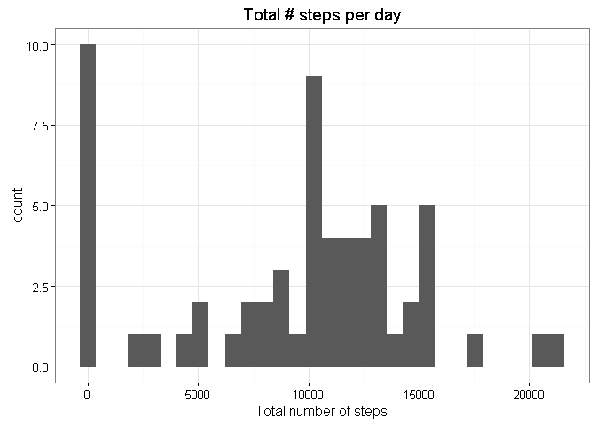
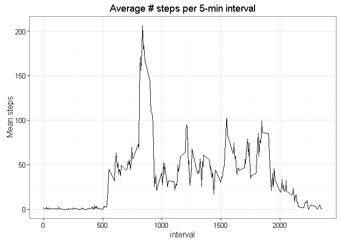
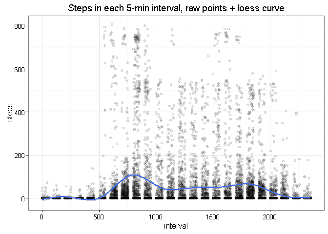
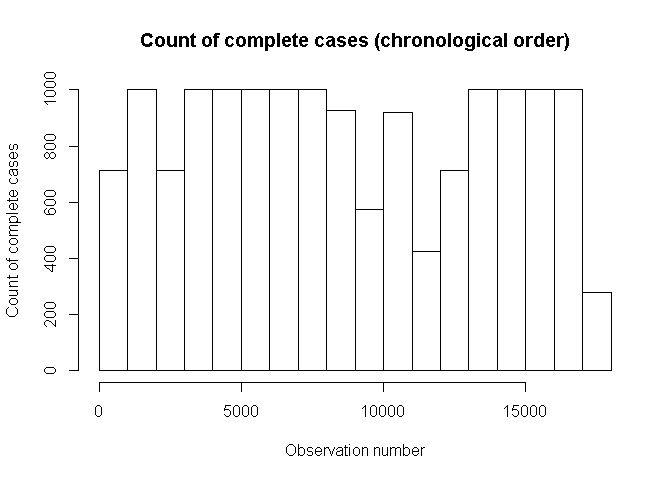
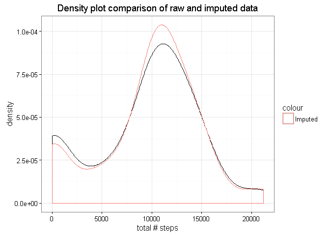
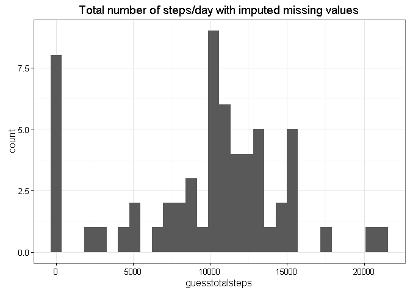
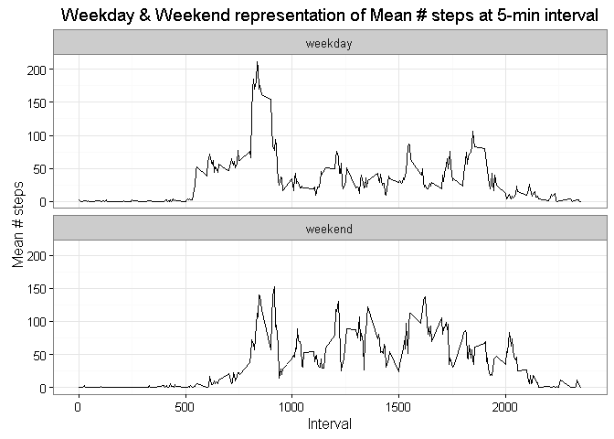

# Reproducible Research: Peer Assessment 1


```r
#Header code, setup required libraries
library(ggplot2)
library(plyr)
```

## Loading and preprocessing the data

```r
#Loading from csv
activity<-read.csv("activity.csv",colClasses=c("integer","Date","integer"))

##Calculate # steps per day
numStepsPerDay<-ddply(activity, c("date"),summarise,totalsteps=sum(steps,na.rm=TRUE))

##Calculate # steps at 5mins intervals
numStepsPer5MinInterval<-ddply(activity, c("interval"),summarise,meansteps = mean(steps,na.rm=TRUE))
```


## What is mean total number of steps taken per day?
Mean total number of steps taken per day: 9354.2295082.  Median total number of steps taken per day: 10395.


```r
stepshist<-ggplot(numStepsPerDay,aes(x=totalsteps))+geom_histogram()+
  xlab("Total number of steps")+ ggtitle("Total # steps per day")+ theme_bw()
print(stepshist)
```

```
## `stat_bin()` using `bins = 30`. Pick better value with `binwidth`.
```

<!-- -->


## What is the average daily activity pattern?

```r
dayline<-ggplot(numStepsPer5MinInterval,aes(x=interval,y=meansteps))+geom_line()+
  ggtitle("Average # steps per 5-min interval")+ ylab("Mean steps")+ theme_bw()
print(dayline)
```

<!-- -->

-- Alternative daily activity pattern visualisation, raw points with a loess curve


```r
dayraw<-ggplot(activity,aes(x=interval,y=steps))+geom_point(alpha=.1)+geom_smooth()+
  ggtitle("Steps in each 5-min interval, raw points + loess curve")+
  theme_bw()
print(dayraw)
```

```
## Warning: Removed 2304 rows containing non-finite values (stat_smooth).
```

```
## Warning: Removed 2304 rows containing missing values (geom_point).
```

<!-- -->


Max mean # steps within 5-min interval: 835 with a mean of 206.1698113 steps.


## Imputing missing values
Number of 2304 incomplete records distributed through the data.


```r
hist(which(complete.cases(activity)),
     main="Count of complete cases (chronological order)",
     xlab="Observation number",
     ylab="Count of complete cases"
     )
```

<!-- -->
 
In an attempt to produce a relatively smooth plot, we chose to perform interpolation of points immediately before and after the missing value. For cases where there are consequtive missing values, the mean 5-minute results is used instead.


```r
#q3
step_interpolation <- function(rownumber){
  prevrow=rownumber;
  nextrow=rownumber;
  while(is.na(activity$steps[prevrow])){
    prevrow=prevrow-1
    if(prevrow<1)return(mean(activity[activity$interval==activity$interval[rownumber],"steps"],na.rm=TRUE))
  }
  while(is.na(activity$steps[nextrow])){
    nextrow=nextrow+1
    if(nextrow>nrow(activity))return(mean(activity[activity$interval==activity$interval[rownumber],"steps"],na.rm=TRUE))
  }
  return(
    (activity$steps[prevrow]+activity$steps[nextrow])/2
  )
}

activity_guessNA <-activity
for(n in 1:nrow(activity)){
  if(is.na(activity$steps[n])){
    activity_guessNA$steps[n]=step_interpolation(n);
  }
}
```

NB: We propose using density plot here instead of histogram for better differentiation of the 2 plots. 


```r
stepsperday2<-merge(
  ddply(activity_guessNA, c("date"),summarise,
        guesstotalsteps=sum(steps,na.rm=TRUE)
  ),
  numStepsPerDay,
  by="date"
)

guesscheck<-ggplot(stepsperday2,aes(x=totalsteps))+ geom_density()+ geom_density(aes(x=guesstotalsteps,color="Imputed"))+ ggtitle("Density plot comparison of raw and imputed data")+ xlab("total # steps")+ theme_bw()
print(guesscheck)
```

<!-- -->

Represented in Histogram:

```r
forpeoplewhoreallywanttoseeahistogram<-ggplot(stepsperday2,aes(x=guesstotalsteps))+ geom_histogram()+ ggtitle("Total number of steps/day with imputed missing values")+ theme_bw()
print(forpeoplewhoreallywanttoseeahistogram)
```

```
## `stat_bin()` using `bins = 30`. Pick better value with `binwidth`.
```

<!-- -->

Mean # steps: 9354.2295082  Median # steps: 10395.  Imputed mean # steps: 9707.219301  Imputed median # steps: 1.0571\times 10^{4}. 


## Are there differences in activity patterns between weekdays and weekends?
It has been observed that there's significant increase in activities over  weekends.


```r
paindays= c("Monday","Tuesday","Wednesday","Thursday","Friday")

activity_guessNA$weekday<-as.factor(ifelse(weekdays(activity_guessNA$date)%in%paindays,"weekday","weekend"))

stepsperinterval.weekdaysplit<-ddply(activity_guessNA, c("interval","weekday"),summarise,meansteps = mean(steps,na.rm=TRUE))

weekdayplot<-ggplot(stepsperinterval.weekdaysplit,aes(x=interval,y=meansteps))+ facet_wrap(~weekday,nrow=2,ncol=1)+ geom_line()+ theme_bw()+ ggtitle("Weekday & Weekend representation of Mean # steps at 5-min interval")+ ylab("Mean # steps")+ xlab("Interval")
print(weekdayplot)
```

<!-- -->
